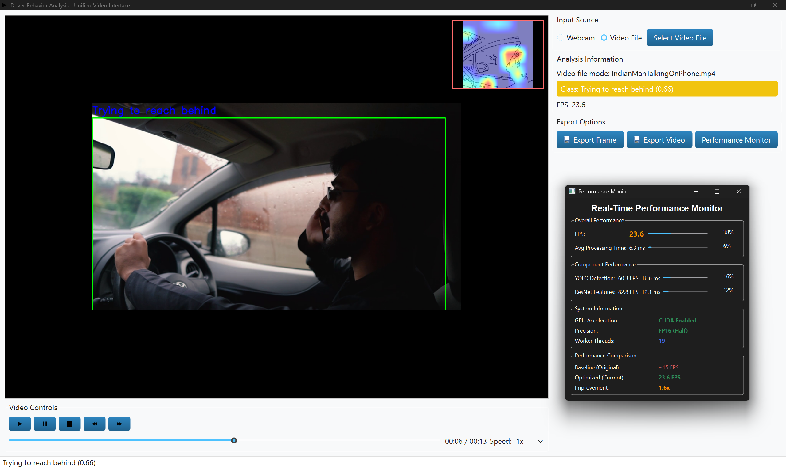

# Usage Guide:

## Starting the Application:

### Method 1: Using the Start Script (Recommended):

On Windows (PowerShell):

```powershell
.\start.ps1
```

This script will:
- Activate the virtual environment.
- Configure Qt environment variables.
- Verify model files.
- Launch the application.

### Method 2: Direct Python Execution:

```bash
python main.py
```

Ensure the virtual environment is activated before running this command.

## Main Application Interface:

Upon launching the application, you will see the main window with the following components:

- **Video Display Area:** Central area showing the processed video stream.
- **Control Buttons:** Start Webcam, Open Video File, Stop, and Settings.
- **Status Bar:** Displays current processing status and FPS.
- **Information Panel:** Shows detected behavior, confidence scores, and frame information.

## Common Workflows:

### Workflow 1: Real-time Webcam Monitoring:

1. **Launch the application** using one of the methods above.
2. **Click "Start Webcam"** button.
3. **Grant camera permissions** if prompted by your operating system.
4. **Observe the video stream** with real-time behavior classification.
5. **View results:**
   - Detected behavior label (e.g., "Safe Drive", "Using Phone").
   - Confidence score (0-100%).
   - Grad-CAM heatmap overlay.
   - Edge-enhanced visualization.
6. **Click "Stop"** to end the webcam session.

### Workflow 2: Video File Analysis:

1. **Launch the application.**
2. **Click "Open Video File"** button.
3. **Select a video file** (supported formats: .mp4, .mov, .avi).
4. **Processing begins automatically:**
   - The video plays with real-time behavior classification.
   - Results are displayed for each frame.
5. **View results** as described in Workflow 1.
6. **Click "Stop"** to end video processing.

### Workflow 3: Adjusting Settings:

1. **Click "Settings"** button in the main window.
2. **Adjust configuration parameters:**
   - **Confidence Threshold:** Minimum confidence for detections (0.0-1.0).
   - **Resize Width:** Input frame width for processing (e.g., 960).
   - **Device:** Select CPU or CUDA for processing.
   - **Model Paths:** Specify paths to YOLO and XGBoost models.
3. **Click "Apply"** to save changes.
4. **Click "OK"** to close the settings dialog.

## Understanding the Output:

### Behavior Classification:

The system displays the detected behavior with a confidence score:

- **Safe Drive (0):** Driver is attentive and focused on the road.
- **Using Phone (1):** Driver is holding or interacting with a mobile device.
- **Talking on Phone (2):** Driver is engaged in a phone conversation.
- **Trying to Reach Behind (3):** Driver is reaching toward the back seat.
- **Talking to Passenger (4):** Driver is interacting with passengers.

### Grad-CAM Heatmap:

The Grad-CAM visualization shows which regions of the driver's image the model focused on for its prediction:

- **Red/Hot areas:** High attention regions.
- **Blue/Cool areas:** Low attention regions.
- **Overlay on edges:** Heatmap is overlaid on Canny edge-enhanced frames for clarity.

### Confidence Score:

A percentage (0-100%) indicating the model's confidence in the predicted behavior. Higher scores indicate more reliable predictions.

### Frame Information:

Displays the current frame number, total frames (for video files), and processing speed (FPS).

## Advanced Usage:

### Customizing Configuration:

Edit `driversafety/config/default.yaml` for advanced customization:

```yaml
# Model paths
yolo_model_path: "models/yolo/yolov8_driver_face_detector.pt"
xgboost_model_path: "models/xgboost/resnet_features_behavior_classifier.json"

# Processing parameters
confidence_threshold: 0.5
resize_width: 960
device: "cuda"  # or "cpu"

# Grad-CAM settings
gradcam_layer: "layer4"
```

### Using Different Models:

To use alternative models:

1. **Replace model files** in the `models/` directory.
2. **Update paths** in `driversafety/config/default.yaml`.
3. **Restart the application.**

### Batch Processing:

For processing multiple video files programmatically:

```python
from driversafety.detection.face_detector import DriverFaceDetector
from driversafety.classification.feature_extractor import ResNetFeatureExtractor
from driversafety.classification.behavior_classifier import BehaviorClassifier
import cv2

# Initialize models
detector = DriverFaceDetector("models/yolo/yolov8_driver_face_detector.pt")
extractor = ResNetFeatureExtractor()
classifier = BehaviorClassifier("models/xgboost/resnet_features_behavior_classifier.json")

# Process video
cap = cv2.VideoCapture("path/to/video.mp4")
while cap.isOpened():
    ret, frame = cap.read()
    if not ret:
        break
    
    # Detect driver region
    detections = detector.detect(frame)
    
    # Extract features and classify
    for detection in detections:
        features = extractor.extract(frame, detection)
        behavior = classifier.predict(features)
        print(f"Behavior: {behavior}")

cap.release()
```

## Troubleshooting:

### Issue: Application fails to start.

**Solution:** Ensure all dependencies are installed by running `setup.ps1` again. Check that model files are present in the `models/` directory.

### Issue: Webcam not detected.

**Solution:** Verify camera permissions in your operating system settings. Try closing other applications using the camera. Check if the camera index is correct in the configuration.

### Issue: Slow processing or low FPS.

**Solution:** Reduce the `resize_width` in settings or configuration. Enable CUDA acceleration if you have an NVIDIA GPU. Close other resource-intensive applications.

### Issue: Inaccurate behavior classification.

**Solution:** Ensure proper lighting and camera angle. Verify that model files are correct and not corrupted. Check confidence threshold settings.

### Issue: Grad-CAM visualization not displaying.

**Solution:** Ensure ResNet50 is being used for feature extraction. Verify that the Grad-CAM layer target is correct in the configuration.

## Performance Optimization:

### For CPU Processing:

- Reduce `resize_width` to 640 or lower.
- Disable Grad-CAM visualization if not needed.
- Close other applications to free up system resources.

### For GPU Processing:

- Ensure CUDA-enabled PyTorch is installed.
- Set `device: "cuda"` in the configuration.
- Increase `resize_width` for better accuracy.

## Visual Examples:

### Application Interface:



The interface displays the processed video stream with real-time behavior classification, Grad-CAM attention heatmaps overlaid on edge-enhanced frames, and performance metrics including FPS and confidence levels.

### Example 1: Driver Talking on Phone

[View video: AsianDriverTalkingOnPhone.mp4](visuals/AsianDriverTalkingOnPhone.mp4)

This example demonstrates the system's detection of a driver engaged in a phone conversation, illustrating how the model identifies this dangerous distraction behavior and displays the corresponding confidence score.

### Example 2: Normal Driving Behavior

[View video: FemaleDriverWithNormalDriving.mp4](visuals/FemaleDriverWithNormalDriving.mp4)

This example showcases normal, attentive driving behavior, demonstrating how the system correctly classifies safe driving patterns and maintains appropriate confidence thresholds for non-distracting activities.

## Tips and Best Practices:

1. **Lighting:** Ensure adequate lighting for accurate face detection.
2. **Camera Angle:** Position the camera to capture the driver's face clearly.
3. **Model Accuracy:** Use high-quality training data for custom models.
4. **Regular Updates:** Keep dependencies updated for security and performance improvements.
5. **Testing:** Test the system with various scenarios before deployment.

## Support and Documentation:

For more information, refer to:

- **[README.md](README.md):** Project overview and features.
- **[InstallationAndSetup.md](InstallationAndSetup.md):** Installation and setup guide.
- **[LICENSE.md](LICENSE.md):** License information.

## Feedback and Contributions:

Your feedback and contributions are valuable. Please report issues or suggest improvements through the project's issue tracker or contact the maintainers.

